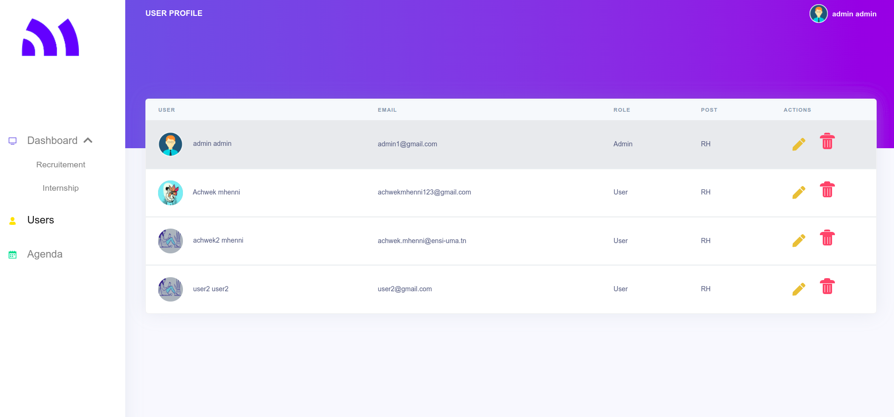

# RecruitPro

<!-- Heading of Template -->
<h1>
Recruitement management platform 
</h1>

<!-- Main image of Template -->

<!-- Description of Template -->

During my internship, I took on the responsibility of developing a comprehensive recruitment management platform for the company. This platform was designed to streamline and oversee the entire recruitment process, catering to both internships and full-time employment opportunities. By creating this platform, I facilitated efficient coordination and management of recruitment-related activities within the organization.

  These are the main interfaces of our application

<!-- Versions of Template -->

<!-- Upgrade to Premium version of Template -->
<h2>Dashboard : Recruitement candidats</h2>
    
     
    
<h2>Dashboard : Internship candidats</h2>
    
         

<h2>Users List</h2>
    
         

<h2>Agenda</h2>
    
         

<h2>Signup page</h2>
    
         

 

    
    
    